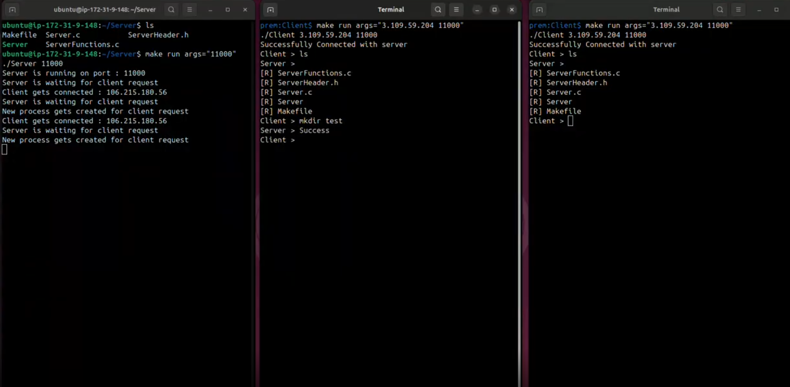

# Remote Drive Access System (RDAS)

## Cloud-Based Remote Storage & File Management System

The **Remote Drive Access System (RDAS)** is a powerful Client--Server
based application developed using **C Programming and TCP Socket
Programming on Linux**.

RDAS acts as a lightweight **cloud-based remote storage and file
management system**, allowing clients to securely connect to a remote
server and perform file system operations in real time.

The system simulates a remote shell environment, providing capabilities for directory browsing, file management, and file transfer over a TCP network. Leveraging multi-processing, RDAS supports **multiple clients** concurrently, ensuring independent and seamless sessions for each connected user.

------------------------------------------------------------------------

## System Architecture

RDAS follows a **Client--Server Architecture**:

-   **Server**
    -   Runs on Linux
    -   Listens for incoming TCP connections
    -   Processes client commands
    -   Executes file system operations
    -   Sends structured responses back to the client
-   **Client**
    -   Connects using server IP & port
    -   Sends supported commands
    -   Displays server responses interactively

------------------------------------------------------------------------

## Screenshots

### Application Screenshot



------------------------------------------------------------------------

### List of Commands Supported by Application

| Command | Description |
| :--- | :--- |
| `ls` | List all files |
| `ls -s` | List files along with their sizes |
| `pwd` | Display present working directory |
| `cd` | Change directory |
| `mkdir` | Create a new directory |
| `rmdir` | Delete an empty directory |
| `rm` | Delete a file |
| `dnf` | Download file from server |
| `upf` | Upload file to server |
| `man` | Display manual of commands |
| `cls` | Clear screen |
| `exit` | Terminate the application |
------------------------------------------------------------------------

## Working Flow

1.  Start the server.
2.  Server binds to IP and port.
3.  Client connects using server IP and port.
4.  Client sends command.
5.  Server executes command.
6.  Server sends response.
7.  Session ends when `exit` is executed.

------------------------------------------------------------------------

## Compilation & Execution

### Compile Using Makefile

``` bash
make
```

### Run Server

``` bash
make run args="port_number"
```

### Run Client

``` bash
make run args="ip_address port_number"
```
------------------------------------------------------------------------
## Project Structure

``` text
RDAS/
├── Server/
│   ├── Server.c
│   ├── ServerFunctions.c
│   ├── ServerHeader.h
│   └── Makefile
└── Client/
    ├── Client.c
    ├── ClientFunctions.c
    ├── ClientHeader.h
    └── Makefile
```

------------------------------------------------------------------------

## Author

**Prem Choudhary**\
Linux System Programming \| Socket Programming \| Client-Server Systems
\| Cloud Concepts

------------------------------------------------------------------------

⭐ If you found this project interesting, feel free to fork and enhance
it!
